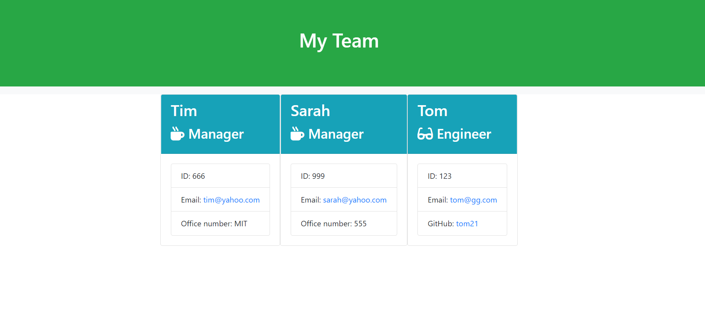

<h1 align="center">Team Profile Generator Using Node.js</h1>


   
## Description

🔍 A node.js application that uses user input from inquirer to populate a index.html file displaying members of a development team. The team.html file is created in the output directory and can be found [here](output/team.html)  
  
💻 Below is the generated html with the info of the team :
  

  
🎥 The full movie file showing functionality of the application can be found [here](./src/myTeam.webm)  
  
## User Story
  
```
As a manager
I want to generate a webpage that displays my team's basic info
so that I have quick access to emails and GitHub profiles
```

  
## Table of Contents
- [Description](#description)
- [User Story](#user-story)
- [Table of Contents](#table-of-contents)
- [Installation](#installation)
- [Usage](#usage)
- [Testing](#testing)


## Installation
💾   
  
`npm init`
  
`npm install inquirer`

`npm install validator`

`npm install jest `
  
## Usage
💻   
  
Run the following command at the root of your project and answer the prompted questions:
  
`node app`

## Testing
✏️

`npm install jest `

Testing is done with jest and contains testing for all four Classes: `Employee`, `Manager`, `Engineer` and `Intern`.


